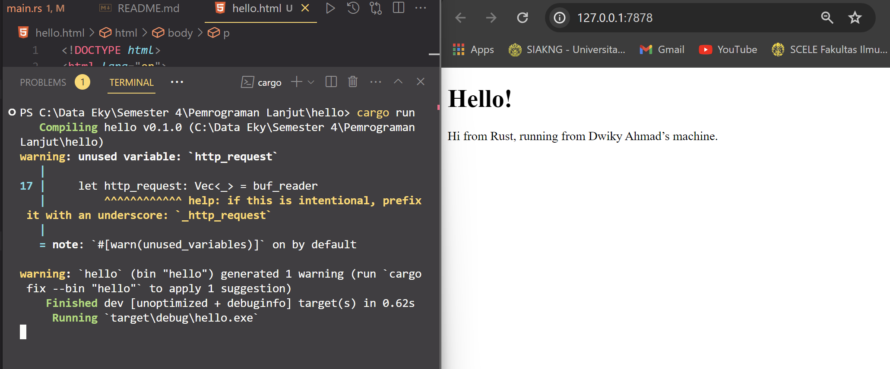
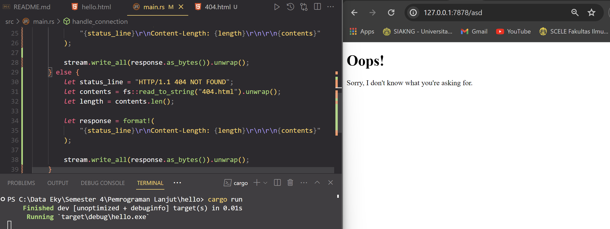

# Reflection

## Commit 1 Reflection Notes
function handle_connection akan membuat sebuah bufReader dari object mutable TcpStream yang di pass dari parameter dan membuat sebuah Vector String yang berisikan data HTTP request menggunakan method `lines()` untuk mendapatkan data yang masuk pada bufReader dan `unwrap()` untuk mendapatkan konten dari setiap baris data sampai baris terakhir menggunakan method `take_while()`, lalu menggunakan method `collect()` untuk disimpan sebagai `Vec<String>` dan di print request tersebut ke console.

## Commit 2 Reflection Notes

Pada function handle_connection yang baru, function tersebut akan memberikan sebuah fixed response dari setiap TcpStream yang masuk ke listener, response status akan diberikan selalu bernilai 200, content length dari file `hello.html`, dan file content `hello.html` yang akan diberikan dalam format {status_line}\r\nContent-Length:{length}\r\n\r\n{contents} kepada user.

## Commit 3 Reflection Notes

Pada commit 3 ini, function handle_connection dibuat untuk memberikan conditional pada page yang tidak diketahui dengan memberikan response file `404.html`, cara memisahkan antara response lainnya adalah menggunakan if else yang di mana variable status_line dan filename akan berbeda tergantung get request yang diminta, alasan kenapa refactoring yang dilakukan seperti itu penting adalah if else dengan cara biasa akan memiliki banyak repetisi pada kode membaca file dan menulis content dari file ke stream, maka untuk mengurangi repetisi akan dilakukan refactoring dengan melakukan ekstraksi pada variabel status line dan filename. Repetisi sangat penting untuk membuat kode mudah dibaca dan maintainability yang baik.

## Commit 4 Reflection Notes
Pada commit ke 4 ini, dapat dilihat bahwa kode mensimulasikan sebuah page yang memerlukan response yang lama pada server yang dijalankan pada sebuah single thread, hal ini memberikan performa yang buruk ketika terdapat user yang bersamaan ingin mengakses sebuah page pada website yang threadnya sedang mengalami slow response, membuat case user yang seharusnya mendapatkan respons cepat pada halaman `/` harus menunggu user lainnya terlebih dahulu yang sedang mengakses halaman `/sleep`. Jika terdapat banyak user yang mengakses server tentunya user akan kesulitan mengakses halaman website karena panjangnya antrian pada request halaman yang membutuhkan waktu load yang lama.

## Commit 5 Reflection Notes
ThreadPool bekerja dengan menyiapkan sebuah queue dari thread yang menunggu perintah untuk mejalankan sebuah kode, hal ini berguna untuk menghindari serangan DDoS dan tetap melakukan implementasi multi-threading, pada kode ini dibuat sebuah ThreadPool yang menyimpan koleksi dari Worker yang bekerja seperti thread yang dapat menunggu perintah untuk melaksanakan sebuah kode.